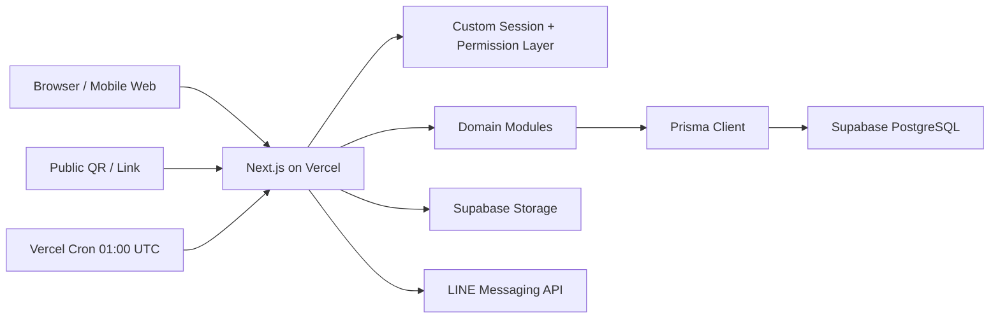
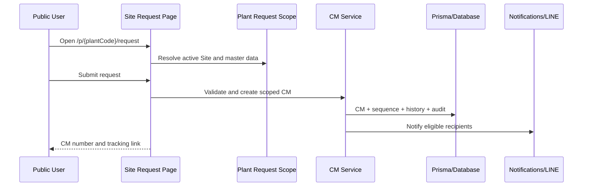
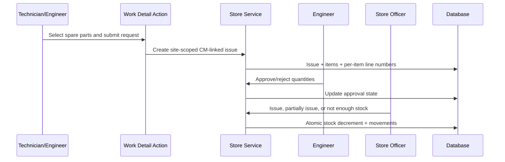

# System Architecture

## 1. Architecture Style

PowerCare.CM is a Next.js **modular monolith** deployed as one Vercel application. It uses React Server Components for reads, Server Actions for most internal mutations, Route Handlers for integration/media/download endpoints, Prisma for persistence, Supabase PostgreSQL in production, and Supabase Storage for durable files.

This architecture was selected because CM and Store operations share users, sites, permissions, audit records, and transactions. Keeping them in one deployable unit minimizes distributed-system overhead while the domain is still evolving.

## 2. Runtime Topology

Local development replaces PostgreSQL with SQLite and may replace Supabase Storage with the local `storage/` directory.

## 3. Frontend Structure

### App Router

The `app/` directory is the route tree. Most pages are Server Components that:

1. call `requireUser()` when private;
2. build organization/site operational scope;
3. load page data through Prisma or module query functions;
4. render shared components;
5. define page-local Server Actions for mutations.

Important route groups:

- `app/dashboard/`: operational CM dashboard.
- `app/work/`: CM list and detail.
- `app/activities/`: unified action queue.
- `app/inventory/`: Store/Spare Parts UI.
- `app/admin/`: organization, sites, users, permissions, settings, LINE, and master data.
- `app/p/[plantCode]/`: site-specific public request/tracking/store issue.
- `app/reports/`: report, export, and print.

### Shared Components

- `components/app-shell.tsx`, `desktop-sidebar.tsx`, and `mobile-app-drawer.tsx`: authenticated shell.
- `components/app-nav-links.tsx`: role/permission-aware navigation model.
- Shared date picker, filter bars, charts, status cards, confirmation controls, and auto-submit selects.
- `components/store/`: Store-specific drawers, tables, issue actions, and UI helpers.
- `components/organization-site-map.tsx`: organization hierarchy visualization and user drawer.

Client components are used for interactive state such as drawers, responsive menus, theme, charts, date range, and sticky replacement headers. Business authorization remains server-side.

## 4. Backend Structure

### Domain Modules

The `modules/` directory holds business rules:

- `auth/`: permission keys, role baselines, and work authorization.
- `organization/`: default tenant foundation, scope loading, Site profiles, and public route resolution.
- `cm-work/`: state machine, numbering, transitions, assignment, and CM types.
- `store/`: Store scope, master data, stock receive/issue/adjustment, numbering, reports, and LINE events.
- `line/`: webhook verification, group discovery, routing, delivery, and daily reports.
- `notifications/`: recipients, unread/read state, and scoped targets.
- `reports/`, `dashboard/`, `members/`, `announcements/`, `settings/`, `sla/`, `audit/`, `documents/`.

### Server Actions

Most writes are Server Actions in page files. Actions must:

1. require an authenticated user where applicable;
2. assert a permission;
3. resolve organization/site scope;
4. validate FormData;
5. call a domain service or an atomic Prisma transaction;
6. write history/audit/notification records;
7. revalidate or redirect.

Server Actions are internal application contracts. They are not stable external APIs.

### Route Handlers

Route Handlers are limited to:

- LINE webhook and cron;
- QR image generation;
- media delivery;
- notification read redirects;
- XLSX export.

See [API.md](./API.md).

## 5. Supabase Usage

### PostgreSQL

Production Prisma uses `prisma/schema.supabase.prisma`. Supabase migrations are stored separately in `prisma/supabase-migrations/` and must be applied in order.

RLS is enabled on core, communication, organization, and Store tables. Existing policies grant broad `FOR ALL` server access to the database role named `prisma`. Consequently:

- browser clients do not access these tables directly;
- Prisma server queries are responsible for tenant isolation;
- RLS protects public/anonymous access but is not a substitute for application scope checks.

### Storage

`lib/file-storage.ts` chooses local or Supabase storage. Stored file metadata remains in PostgreSQL; object bytes are stored in buckets. The driver supports replacement uploads for profile photos/signatures and scoped logo/media paths.

Expected buckets include profile photos, signatures, announcements, organization logos, and site logos. Bucket creation/policy state must be verified per environment.

## 6. State Management

There is no global Redux/Zustand-style store.

- Durable state: PostgreSQL/SQLite through Prisma.
- Authentication state: HTTP-only cookie plus DB lookup.
- URL state: search params for filters, date ranges, site/category/status, and pagination.
- Server-rendered state: React Server Components.
- Local interaction state: React state in client components for drawers, menus, theme, chart hover, and date picker.
- Cache: query helpers in `lib/query-cache.ts`; mutations must revalidate affected paths/caches.
- Theme preference: browser session behavior with Bangkok-time default on first visit, then user toggle for the current website session.

## 7. Data Flow Examples

### Public CM Request

### CM-linked Spare-Part Issue

## 8. Tenancy and Data Isolation

Tenant isolation is hierarchical:

- `organizationId` separates customer organizations.
- `plantId` separates Sites within an organization.
- Category restrictions further limit CM claim/assignment.
- Store master and transaction records carry both organization and Site IDs.

Scope helpers are mandatory. Owner Admin may choose organization/site; Organization Admin stays within its organization; Site roles stay within their Site. Public routes resolve a Site by unique public code before reading or writing.

## 9. Time and Scheduling

- Persist timestamps as UTC.
- Display with `Asia/Bangkok` helpers.
- Thai UI often displays Buddhist Era years.
- Vercel Cron uses UTC. `0 1 * * *` equals 08:00 Thailand.
- `LineDailyReportSetting.sendTime` is a string interpreted by application logic.

## 10. Deployment

- Development: `npm run dev:local` with SQLite, or `npm run dev:supabase` against a guarded non-production Supabase target.
- Build: local `npm run build`; Vercel uses `npm run build:vercel` and the PostgreSQL Prisma schema.
- Production: Vercel application + Supabase PostgreSQL/Storage + LINE API.

Do not use `prisma db push` against production as a casual release mechanism. Prefer reviewed SQL migrations, backup, dry-run/preview verification, then production application.

## 11. Architecture Constraints

- Preserve modular-monolith boundaries unless a measured need justifies extraction.
- Keep direct browser access away from Supabase service-role credentials.
- Do not move authorization into client-only code.
- Do not couple public Site routing to a user session.
- Do not let organization/site selectors override server-computed scope.
- Keep Store stock changes transactional and auditable.
- Keep both Prisma schemas and migration tracks synchronized.

## 12. Known Architecture Debt

- Custom session implementation is below production security expectations.
- Oversized pages contain too much orchestration.
- Dual schema/migration tracks are manual.
- RLS is server-role permissive rather than tenant-policy-driven.
- Internal `Plant` and external `Site` terminology is inconsistent.
- External integration API is not formalized.
- Several workflows use string statuses rather than schema-level enums.
